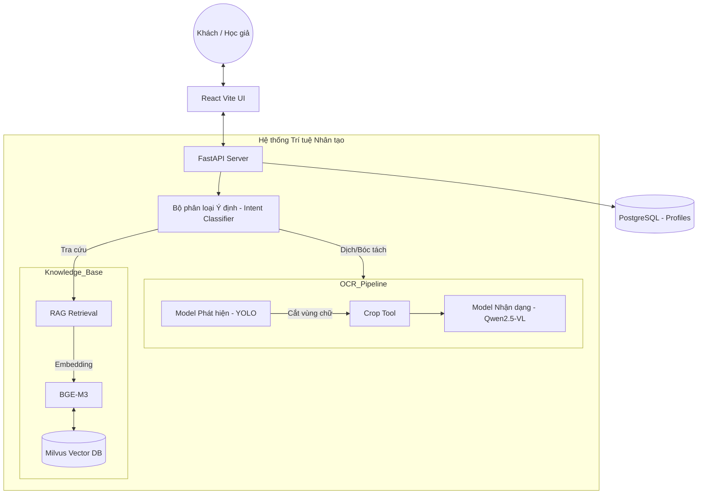

# Nền tảng Di sản Số Hán-Nôm Thông minh (Agentic Hán-Nôm Heritage Platform)


Dự án **Hán-Nôm Heritage** là một hệ sinh thái AI toàn diện chuyên biệt cho di sản văn hóa Việt Nam. Hệ thống chuyển đổi mã nguồn từ các mô hình nhận dạng đơn thuần thành một **Agent thông minh** có khả năng tra cứu, hiểu và bảo tồn thư tịch cổ (Hán Nôm, Bia đá, Mộc bản) với độ chính xác học thuật cao.

---

## 🏗️ Kiến trúc Tổng thể (System Architecture)

Dưới đây là sơ đồ kết nối luồng dữ liệu từ giao diện người dùng đến các mô hình AI chạy cục bộ:



---

## 🏛️ Lớp Cốt lõi (Core Layers)

Hệ thống được xây dựng trên mô hình 3 lớp cốt lõi nhằm giải quyết bài toán "Ảo tưởng" (Hallucination) của AI:

### 1. Lớp Trí tuệ (AI Engine & RAG)
- **Qwen 2.5-VL (Vision-Language):** Mô hình đa phương thức chạy cục bộ trên GPU (RTX 5060 Ti), bóc tách trực tiếp văn bản từ ảnh scan cổ.
- **BGE-M3 Embeddings:** Mã hóa 58,000 mục dữ liệu di sản (Từ điển, văn bia).
- **Milvus Vector DB:** Lưu trữ và truy xuất ngữ nghĩa với độ trễ cực thấp (<100ms).

### 2. Lớp An toàn "Vòng Kim Cô" (Safety Guardrails)
- **Kiểm soát Tham số:** Khóa `temperature=0.01` để đảm bảo câu trả lời nhất quán.
- **Hệ thống Lọc 3 Lớp:** Chặn từ khóa phi học thuật, xử lý lỗi anachronism (sai niên đại), và ngưỡng tự tin (Confidence Threshold > 0.45).

### 3. Cá nhân hóa (Agentic SOA)
- **Hồ sơ nghiên cứu:** Lưu trữ lịch sử và chuyên môn của học giả để điều chỉnh câu trả lời.

---

## 🔍 Quy trình OCR & Bóc tách Văn bản (The Process)

Quy trình bóc tách từ một tấm ảnh scan di sản sang văn bản số hóa (Chữ Nôm) diễn ra qua 4 giai đoạn:

### Bước 1: Phát hiện Vùng văn bản (Text Detection)
Sử dụng **YOLO (v8/11)** được huấn luyện đặc biệt trên bộ dữ liệu di sản để xác định tọa độ các cột chữ hoặc chữ đơn. Điều này giúp hệ thống bỏ qua các nhiễu từ nền giấy hoặc hoa văn trang trí.

### Bước 2: Cắt & Tiền xử lý (Cropping)
Các vùng chữ được bóc tách và chuẩn hóa. Hệ thống tự động nhận diện hướng viết (Dọc/Ngang) để xoay ảnh về góc nhìn tối ưu cho mô hình nhận dạng.

### Bước 3: Nhận dạng Chữ (Recognition)
Mô hình **Qwen 2.5-VL** (được tinh chỉnh qua LoRA) tiếp nhận các vùng ảnh cắt. Thay vì đọc tuần tự đơn thuần, mô hình hiểu được cấu trúc nét vẽ của chữ Nôm và chữ Hán cổ để xuất ra chuỗi ký tự text chính xác.

### Bước 4: Đối soát & Hiệu đính (RAG Correction)
Chuỗi text thô sau OCR được đưa vào lớp RAG:
- So khớp với từ điển Thiều Chửu/Hán Việt để sửa các lỗi nhận diện sai.
- Gán âm Hán Việt và định nghĩa ngữ cảnh cho từng chữ.

---

## 📂 Giao diện Đa chế độ (Hybrid UX)

Dự án cung cấp hai không gian làm việc tách biệt:
- **Hành lang Di sản (Public Portal):** Cho công chúng khám phá di sản một cách trực quan.
- **Không gian Nghiên cứu (Researcher Workspace):** Cho học giả bóc tách dữ liệu, quản lý Delta Lake và giám sát hạ tầng GPU.

---

## 🛠️ Cấu trúc Thư mục & GitHub Readiness

Để triển khai dự án lên GitHub, cấu trúc được tổ chức như sau:

```text
.
├── backend/            # FastAPI Server & AI Execution
├── frontend/           # React App (Vite)
├── scripts/            # Inference & Data Pipeline
│   ├── training/       # Scripts huấn luyện Model (YOLO, Qwen)
│   └── inference/      # Scripts bóc tách (yolo_qwen_pipeline.py)
├── models/             # Chứa Model weights (local)
└── data/               # Metadata và Database files
```

---

## 📥 Hướng dẫn Cài đặt & Chạy
*(Xem chi tiết trong phần hướng dẫn cài đặt ở phiên bản trước hoặc file INSTALL.md)*

1. Khởi động **Milvus DB** qua Docker.
2. Chạy **Backend FastAPI** tại `backend/app/main.py`.
3. Chạy **Frontend React** tại `frontend/`.

---
*Hán-Nôm Heritage - Bảo tồn tinh hoa Việt qua sức mạnh của Trí tuệ Nhân tạo.*
