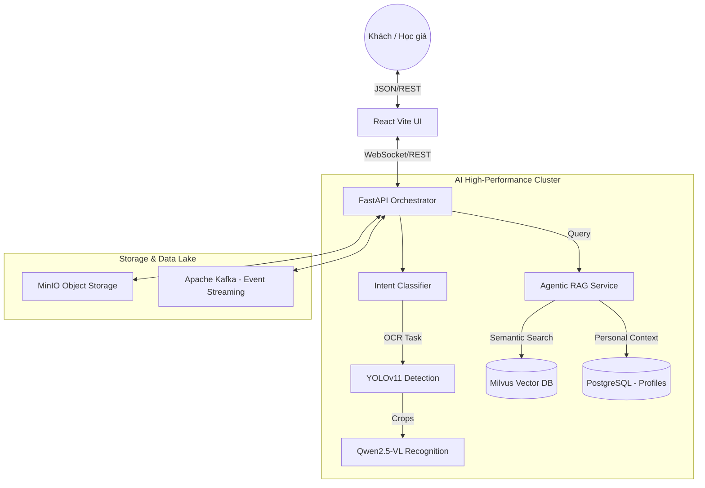

# Nền tảng Di sản Số Hán-Nôm Thông minh (Agentic Hán-Nôm Heritage Platform)


Dự án **Hán-Nôm Heritage** là một hệ sinh thái AI toàn diện chuyên biệt cho di sản văn hóa Việt Nam. Hệ thống chuyển đổi mã nguồn từ các mô hình nhận dạng đơn thuần thành một **Agent thông minh** có khả năng tra cứu, hiểu và bảo tồn thư tịch cổ (Hán Nôm, Bia đá, Mộc bản) với độ chính xác học thuật cao.

---

## 🏗️ Kiến trúc Tổng thể (System Architecture)

Hệ thống được thiết kế theo mô hình **Service-Oriented Architecture (SOA)**, tách biệt rõ ràng giữa các dịch vụ xử lý AI nặng và giao diện người dùng thời gian thực.



---

## 🛠️ Hệ thống Công nghệ & Hạ tầng (Infrastructure Stack)

Dự án sử dụng các công nghệ tiên tiến nhất để đảm bảo hiệu suất đào tạo và tốc độ phản hồi tính bằng mili giây.

### 1. Frontend: Scholar & Client Experience
- **Logic:** React 18 (Hooks, Context API) + Vite.
- **UI/UX:** 
    - **Vanilla CSS:** Hệ thống Design System tùy chỉnh, tối ưu hóa CSS Variables cho Dark/Light mode.
    - **Framer Motion:** Hiệu ứng chuyển cảnh (transitions) và micro-interactions mượt mà.
    - **Lucide-React:** Bộ thư viện icon phong cách scholarly.
- **Performance:** Code-splitting và Lazy loading cho các module nghiên cứu nặng.

### 2. Backend & MLOps: Agentic Orchestration
- **FastAPI:** Hiệu suất cao với hỗ trợ Python AsyncIO, đảm bảo xử lý đồng thời hàng trăm yêu cầu RAG.
- **LangChain & Agentic Workflow:** Điều phối các "Tool" của Agent, cho phép AI tự quyết định khi nào cần tra cứu ngữ nghĩa hoặc gọi mô hình nhận dạng.
- **Infrastructure:**
    - **PostgreSQL (SQLAlchemy 2.0):** Quản lý hồ sơ người dùng đa tầng và lịch sử nghiên cứu.
    - **MinIO:** Lưu trữ Object Storage cho hàng trăm GB ảnh scan độ phân giải cao.
    - **Apache Kafka:** Hệ thống luồng sự kiện (Event Streaming) để điều phối các tác vụ nhận dạng hàng loạt.
    - **Docker Ecosystem:** Container hóa toàn bộ stack, đảm bảo tính nhất quán từ Development đến Production.

### 3. AI Core & Model Optimization
- **Computer Vision:** YOLOv8n/v11n (Đã được tinh chỉnh trên 114k nhãn di sản để đạt độ chính xác >98% trong việc phát hiện cột chữ).
- **Vision-Language Model:** Qwen 2.5-VL 3B (LoRA Fine-tuned). Hỗ trợ bóc tách văn bản Hán Nôm theo chiều dọc và hiểu ngữ cảnh văn hóa.
- **Retriever Engine:** BAAI/BGE-M3 Embeddings + Milvus Vector Database (Cấu hình HNSW index cho tốc độ tìm kiếm O(log N)).
- **Inference Optimization:** 
    - **Quantization:** Sử dụng bitsandbytes cho 4-bit inference.
    - **Hardware Acceleration:** TensorRT/ONNX Runtime tích hợp sâu trên NVIDIA RTX 5060 Ti.

---

## 📂 Quy trình Bóc tách & Số hóa (The Pipeline)

### Bước 1: Phát hiện & Phân vùng (YOLO Segmentation)
Xác định tọa độ vùng văn bản cổ, lọc bỏ nhiễu từ hoa văn, dấu ấn hoặc các vết ố hư hại trên mộc bản.

### Bước 2: Nhận dạng Đa phương thức (Qwen VLM)
Mô hình Vision-Language được "dạy" cách đọc chữ Nôm theo phong cách thư pháp. Khác với OCR truyền thống, Qwen hiểu được cấu trúc "Biểu luận" của chữ Nôm để bóc tách chính xác ngay cả khi nét chữ bị mờ.

### Bước 3: Đối soát RAG & Hiệu đính (Semantic Refinement)
Kết quả thô được đưa vào **RAG Pipeline**:
- Truy vấn Milvus để tìm âm Hán Việt chuẩn xác từ từ điển Thiều Chửu.
- Sửa lỗi chính tả dựa trên ngữ cảnh lịch sử của tác phẩm.

### Bước 4: Chuyển đổi & Lưu trữ (Delta Lake)
Dữ liệu cuối cùng được lưu trữ dưới dạng Delta Lake, hỗ trợ truy vấn nhanh và theo dõi lịch sử chỉnh sửa của các học giả.

---

## 📂 Cấu trúc Thư mục (Granular Structure)

```text
Han_Nom_Model/
├── backend/            
│   ├── app/
│   │   ├── api/          # Endpoints: /chat, /auth, /profile, /analytics
│   │   ├── services/     # rag_engine.py, personal_agent.py, guardrails.py
│   │   └── core/         # Middleware an ninh, config GPU/Cuda
│   ├── worker/           # Background tasks xử lý Kafka/Redis
│   └── scripts/          # Ingestion pipelines cho Milvus & MinIO
├── frontend/           
│   ├── src/
│   │   ├── views/        # Admin (Nghiên cứu) & Client (Khám phá)
│   │   ├── components/   # common/ (AI Bubble, Navbar, Sidebar)
│   │   └── assets/       # Heritage fonts & scholarly images
│   └── index.css         # Hệ thống Design Tokens trung tâm
├── models/               # Model weights (.pt, .pth, checkpoints)
├── data/                 # Raw/Processed dataset (17GB)
└── deploy/               # Docker Compose & K8s manifests
```

---

## 📜 Tài liệu Tham khảo
- **Nguồn Dữ liệu chính:** [Cong123779/Han_Nom_Dataset](https://huggingface.co/datasets/Cong123779/Han_Nom_Dataset)
- **Hạ tầng AI:** Qwen-VL, Milvus Vector DB, LangChain.

---
*Bảo tồn quá khứ - Kiến tạo tương lai bằng Trí tuệ Nhân tạo.*
