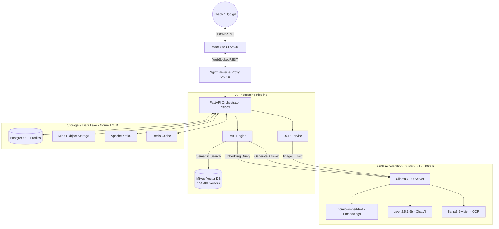

# Nền tảng Di sản Số Hán-Nôm Thông minh (Agentic Hán-Nôm Heritage Platform)


Dự án **Hán-Nôm Heritage** là một hệ sinh thái AI toàn diện chuyên biệt cho di sản văn hóa Việt Nam. Hệ thống chuyển đổi mã nguồn từ các mô hình nhận dạng đơn thuần thành một **Agent thông minh** có khả năng tra cứu, hiểu và bảo tồn thư tịch cổ (Hán Nôm, Bia đá, Mộc bản) với độ chính xác học thuật cao.

> **100% Local GPU Inference** — Không sử dụng Cloud API. Toàn bộ AI chạy trên NVIDIA RTX 5060 Ti thông qua Ollama.

---

## 🏗️ Kiến trúc Tổng thể (System Architecture)

Hệ thống được thiết kế theo mô hình **Service-Oriented Architecture (SOA)**, tách biệt rõ ràng giữa các dịch vụ xử lý AI nặng và giao diện người dùng thời gian thực.


```mermaid
graph TD
    User((Khách / Học giả)) <-- JSON/REST --> Frontend[React Vite UI :25001]
    Frontend <-- WebSocket/REST --> Nginx[Nginx Reverse Proxy :25000]
    Nginx --> Backend[FastAPI Orchestrator :25002]
    
    subgraph GPU_Cluster [GPU Acceleration Cluster - RTX 5060 Ti]
        Ollama[Ollama GPU Server]
        Ollama --> Nomic[nomic-embed-text - Embeddings]
        Ollama --> Qwen[qwen2.5:1.5b - Chat AI]
        Ollama --> Llama[llama3.2-vision - OCR]
    end
    
    subgraph AI_Pipeline [AI Processing Pipeline]
        Backend --> RAG[RAG Engine]
        RAG -->|Embedding Query| Ollama
        RAG -->|Semantic Search| Milvus[(Milvus Vector DB\n154,481 vectors)]
        RAG -->|Generate Answer| Ollama
        
        Backend --> OCR[OCR Service]
        OCR -->|Image → Text| Ollama
    end
    
    subgraph Storage_Layer [Storage & Data Lake - /home 1.2TB]
        Backend <--> Postgres[(PostgreSQL - Profiles)]
        Backend <--> MinIO[MinIO Object Storage]
        Backend <--> Kafka[Apache Kafka]
        Backend <--> Redis[Redis Cache]
    end
```

---

## 🛠️ Hệ thống Công nghệ & Hạ tầng (Infrastructure Stack)

### 1. AI Models (Local GPU - Ollama)
| Model | Kích thước | Chức năng | GPU VRAM |
|---|---|---|---|
| `nomic-embed-text` | 274 MB | Tạo vector embeddings (768d) | ~500 MB |
| `qwen2.5:1.5b` | 986 MB | Chat AI / RAG trả lời câu hỏi | ~1.5 GB |
| `llama3.2-vision` | 7.8 GB | OCR bóc tách chữ Hán Nôm từ ảnh | ~5 GB |

### 2. Vector Database (Milvus)
| Thông số | Giá trị |
|---|---|
| **Collection** | `heritage_knowledge` |
| **Tổng vectors** | 154,481 |
| **Dimension** | 768 (float32) |
| **Nguồn dữ liệu** | Thiều Chửu (8,085) + Trung-Việt (122,596) + Unihan (27,768) |
| **Tốc độ search** | ~1-2ms trên 154K vectors |

### 3. Frontend: Scholar & Client Experience
- **Logic:** React 18 (Hooks, Context API) + Vite.
- **UI/UX:** 
    - **Vanilla CSS:** Hệ thống Design System tùy chỉnh, tối ưu hóa CSS Variables cho Dark/Light mode.
    - **Framer Motion:** Hiệu ứng chuyển cảnh (transitions) và micro-interactions mượt mà.
    - **Lucide-React:** Bộ thư viện icon phong cách scholarly.

### 4. Backend & MLOps: Agentic Orchestration
- **FastAPI:** Hiệu suất cao với hỗ trợ Python AsyncIO.
- **LangChain & Ollama:** RAG Pipeline hoàn toàn nội bộ, không phụ thuộc Cloud API.
- **Infrastructure:**
    - **PostgreSQL (SQLAlchemy 2.0):** Quản lý hồ sơ người dùng.
    - **MinIO:** Object Storage cho ảnh scan.
    - **Apache Kafka:** Event Streaming cho tác vụ nhận dạng hàng loạt.
    - **Redis:** Cache để tối ưu tốc độ phản hồi.
    - **Docker + NVIDIA Runtime:** GPU passthrough cho container AI.

### 5. Hardware Requirements
| Thành phần | Yêu cầu tối thiểu | Khuyến nghị |
|---|---|---|
| **GPU** | NVIDIA GPU 8GB+ VRAM | RTX 5060 Ti 16GB |
| **RAM** | 16 GB | 64 GB |
| **Ổ cứng** | 100 GB SSD | 1TB+ NVMe |
| **Docker** | Docker Engine + NVIDIA Container Toolkit | - |

---

## 🚀 Khởi chạy Nhanh (Quick Start)

### 1. Clone & Cấu hình
```bash
git clone https://github.com/your-repo/Han_Nom_Model.git
cd Han_Nom_Model
cp .env.example .env
# Chỉnh sửa .env nếu cần
```

### 2. Khởi chạy toàn bộ hệ thống
```bash
docker compose up -d
```

### 3. Tải AI Models
```bash
docker exec heritage_ollama ollama pull nomic-embed-text
docker exec heritage_ollama ollama pull qwen2.5:1.5b
docker exec heritage_ollama ollama pull llama3.2-vision
```

### 4. Nạp dữ liệu tri thức
```bash
docker exec heritage_backend python3 /scripts/seed_data.py
```

### 5. Truy cập
| Dịch vụ | URL |
|---|---|
| **Frontend** | http://localhost:25001 |
| **Backend API** | http://localhost:25002 |
| **API Docs** | http://localhost:25002/docs |
| **MinIO Console** | http://localhost:25006 |

---

## 📂 Cấu trúc Thư mục (Project Structure)

```text
Han_Nom_Model/
├── backend/            
│   ├── app/
│   │   ├── api/          # Endpoints: /chat, /auth, /profile, /analytics
│   │   ├── services/     # rag_engine.py, ocr_service.py, vector_ingest.py
│   │   └── core/         # config.py (OLLAMA_BASE_URL, MILVUS settings)
│   ├── scripts/          # seed_data.py, stress_test.py, integration_test.py
│   └── Dockerfile
├── frontend/           
│   ├── src/
│   │   ├── views/        # Admin (Nghiên cứu) & Client (Khám phá)
│   │   ├── components/   # common/ (AI Bubble, Navbar, Sidebar)
│   │   └── assets/       # Heritage fonts & scholarly images
│   └── index.css         # Hệ thống Design Tokens trung tâm
├── data/                 # Từ điển CSV (Thiều Chửu, Trung-Việt, Unihan)
├── models/               # Model weights (.pt, .pth, checkpoints)
├── scripts/              # seed_data.py, upload_dataset.py
├── docker-compose.yml    # 12 services (GPU-enabled)
├── nginx.conf            # Reverse proxy configuration
└── .env                  # Environment variables
```

---

## 📊 Docker Services Map

| Container | Image | Port | Chức năng |
|---|---|---|---|
| `heritage_backend` | Custom (FastAPI) | 25002 | API Server |
| `heritage_frontend` | Custom (React) | 25001 | Web UI |
| `heritage_ollama` | ollama/ollama | - | GPU AI Engine |
| `heritage_ai_worker` | Custom | - | Background AI Tasks |
| `heritage_vector_db` | milvus:v2.4.0 | 25007 | Vector Database |
| `heritage_db` | postgres:16 | 25003 | User Database |
| `heritage_cache` | redis:7 | 25004 | Cache Layer |
| `heritage_storage` | minio | 25005-25006 | Object Storage |
| `heritage_kafka` | cp-kafka:7.4.0 | 25008 | Event Streaming |
| `heritage_proxy` | nginx:alpine | 25000 | Reverse Proxy |

---

## 📜 Tài liệu Tham khảo
- **Nguồn Dữ liệu:** [Cong123779/Han_Nom_Dataset](https://huggingface.co/datasets/Cong123779/Han_Nom_Dataset)
- **AI Engine:** [Ollama](https://ollama.com/) — Local GPU Inference
- **Vector DB:** [Milvus](https://milvus.io/) — Scalable Vector Search
- **Hạ tầng:** Docker + NVIDIA Container Toolkit

---
*Bảo tồn quá khứ — Kiến tạo tương lai bằng Trí tuệ Nhân tạo.*
